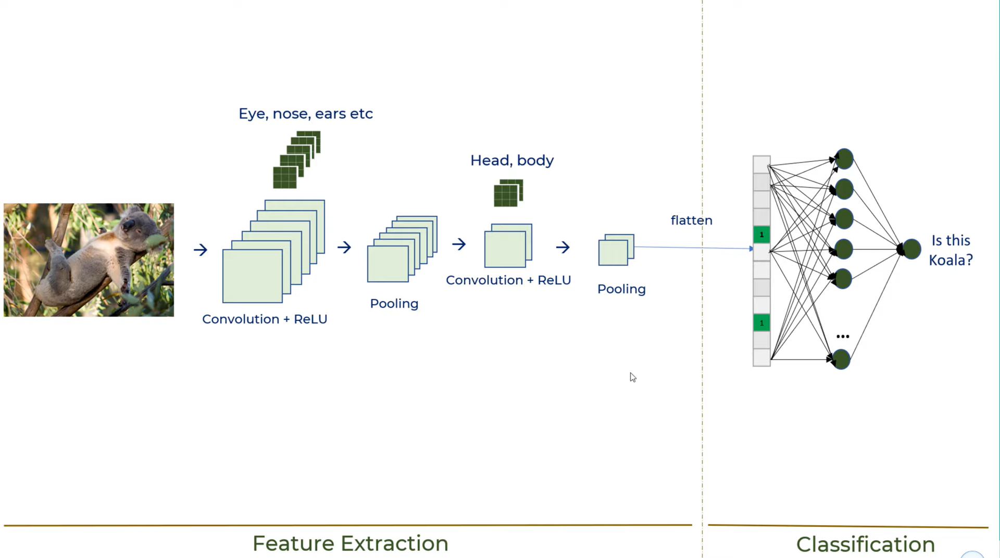

# Image Classification

## Background Understanding

[Tutorial Link](https://www.youtube.com/watch?v=zfiSAzpy9NM)


## Initial Setup

Run as Administrator:
```
python -m venv .\venv
.\venv\Scripts\Activate.ps1
pip install numpy matplotlib tensorflow scikit-learn
```

## Training Model

[Tutorial Link](https://www.youtube.com/watch?v=7HPwo4wnJeA)

## Enhancing Model

References: [Link](https://medium.com/@dipti.rohan.pawar/improving-performance-of-convolutional-neural-network-2ecfe0207de7), [Link](https://medium.com/mlearning-ai/7-best-techniques-to-improve-the-accuracy-of-cnn-w-o-overfitting-6db06467182f)


### Starting Model Analysis

Based on the tutorial:
- Train -> loss: 0.6388, accuracy: 0.7786
- Test  -> loss: 0.9121, accuracy: 0.6994

### Data Augmentation Analysis

[Random Flip](https://www.tensorflow.org/api_docs/python/tf/keras/layers/RandomFlip) felt like the most intuitive augmentation. However, surprisingly, the accuracy of the training data went down and the accuracy of the test data went up, both only marginally:
- Train -> loss: 0.6986 - accuracy: 0.7585
- Test  -> loss: 0.8344 - accuracy: 0.7181

[Random Rotation](https://www.tensorflow.org/api_docs/python/tf/keras/layers/RandomRotation) was considered next at factors of 0.2 and 0.05, but the model did not improve.

[Random Zoom](https://www.tensorflow.org/api_docs/python/tf/keras/layers/RandomZoom) was considered after at factors of 0.2 and 0.05, but the model did not improve again (reasonably so).

### Deeper Network Analysis

Added a third section in the CNN with a Conv2D layer of 128 filters followed by a MaxPooling2D layer:
- Train -> loss: 0.6301 - accuracy: 0.7814
- Test  -> loss: 0.7571 - accuracy: 0.7433

### Tuning Parameters Analysis

Increased number of epochs to 20:
- Train -> loss: 0.4643 - accuracy: 0.8370
- Test  -> loss: 0.8012 - accuracy: 0.7453
- For epoch 1 to 10, the unit change for training accuracy was >1%. However, for epoch 11 to 20, the unit change for training accuracy was <1%.
- Note that the testing accuracy increased <1% after these 10 more epochs.
- For these reasons, the number of epochs was reset to 10.

Changed optimizer to SGD:
- Train -> loss: 1.0382 - accuracy: 0.6365
- Test  -> loss: 1.0960 - accuracy: 0.6118

How to use SGD in tensorflow?
[Link](https://medium.com/analytics-vidhya/why-use-the-momentum-optimizer-with-minimal-code-example-8f5d93c33a53)
- Set momentum=0.9 and nesterov=True:
    - Train -> loss: 0.6494 - accuracy: 0.7738
    - Test  -> loss: 0.8214 - accuracy: 0.7288
- Added learning_rate=0.02
    - Train -> loss: 0.8243 - accuracy: 0.7225
    - Test  -> loss: 1.0006 - accuracy: 0.6729

How to choose best optimizer for training model?
[Link](https://towardsdatascience.com/7-tips-to-choose-the-best-optimizer-47bb9c1219e)
- Based on this, decided to leave optimizer as Adam

### Deeper Network Analysis 2

Removed first Dense layer (64 units):
- Train -> loss: 0.6537 - accuracy: 0.7743
- Test  -> loss: 0.7861 - accuracy: 0.7350

Instead changed first Dense layer to 128 units:
- Train -> loss: 0.5957 - accuracy: 0.7917
- Test  -> loss: 0.7920 - accuracy: 0.7361

Instead changed first Dense layer back to 64 units:
- Train -> loss: 0.6340 - accuracy: 0.7810
- Test  -> loss: 0.7882 - accuracy: 0.7309

Based on above observations, first Dense layer was set to 128 units.

### Batch Normalization Analysis

What is batch normalization?
[Link](https://towardsdatascience.com/batch-normalization-in-3-levels-of-understanding-14c2da90a338)

How to use batch normalization?
[Link](https://www.youtube.com/watch?v=yXOMHOpbon8)
- After all activation functions:
    - Train -> loss: 0.5333 - accuracy: 0.8158
    - Test  -> loss: 0.7948 - accuracy: 0.7288
- After all activation functions and pooling:
    - Train -> loss: 0.5165 - accuracy: 0.8216
    - Test  -> loss: 0.8295 - accuracy: 0.7170
- Before all activation functions:
    - Train -> loss: 0.4913 - accuracy: 0.8271
    - Test  -> loss: 0.7193 - accuracy: 0.7622

Based on above observations, decided to keep batch normalization layers before all activation functions only (that is, not after pooling).
